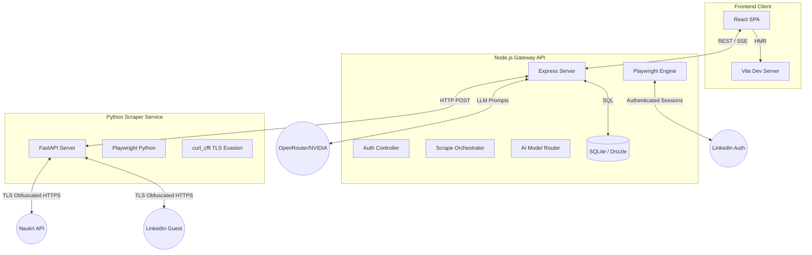

# ApplyPilot - Detailed System Design & Architecture

ApplyPilot is a comprehensive, AI-powered career copilot designed to automate the job search and application process. This document provides a deep, technical breakdown of the platform's holistic design, architecture, internal algorithms, and technology stack.

---

## 1. High-Level Architecture & Data Flow

The platform is designed around a three-tier computational model, emphasizing speed, local-first data storage, and resilient external integrations.

### System Diagram

### Protocol Usage
- **REST APIs:** Used for standard CRUD operations (Profile updates, Resume uploads).
- **Server-Sent Events (SSE):** Utilized by the Live Jobs feature to stream job postings to the client as they are scraped in real-time, preventing long-polling timeouts.
- **Local SQLite I/O:** Provides zero-latency reads/writes for user preferences and ATS scores without needing an external cloud database.

---

## 2. Technology Stack & Rationale

### Frontend (Client-Side)
* **Framework:** **React (v18+)** for component-based architecture.
* **Build Tool:** **Vite**, chosen for its instant Hot Module Replacement (HMR) and significantly faster build times compared to Webpack/CRA.
* **Styling:** **Tailwind CSS**. chosen for utility-first styling, enabling rapid prototyping of the dark-mode glassmorphism aesthetic without writing raw CSS.
* **Icons:** **Lucide-React** for a consistent, modern icon system.
* **State Management:** Native React Hooks (`useState`, `useReducer`, `useMemo`). Complex filter states (like the Live Jobs filters) are consolidated into typed objects rather than scattered primitive states.

### Backend (Server-Side)
* **Runtime:** **Node.js** with **TypeScript** for strict type safety across network boundaries.
* **Web Framework:** **Express.js** handling routing, middleware, and rate-limiting.
* **Database & ORM:** **SQLite** managed by **Drizzle ORM**. Drizzle was selected over Prisma for its zero-dependency SQL-like syntax and lower overhead.
* **File Parsing:** 
  - `pdf-parse`: For extracting text layers from PDF resumes.
  - `mammoth`: For extracting raw text from DOCX files.
* **Browser Automation (Node):** **Playwright (JavaScript)** is used specifically for the authenticated Easy Apply bot, as it can attach to existing browser profiles and maintain persistent LinkedIn cookies.

### Python Microservice (Scraper Layer)
* **Framework:** **FastAPI**, chosen for its asynchronous nature and auto-generated OpenAPI documentation.
* **Anti-Bot Evasion:** 
  - `curl_cffi`: Impersonates Chrome/Firefox TLS fingerprints to bypass Cloudflare and LinkedIn's WAF (Web Application Firewall).
  - `playwright-python`: Used as a fallback for rendering JavaScript-heavy pages that require DOM execution before scraping.
* **Data Validation:** **Pydantic** ensures that the data scraped from external boards exactly matches the expected schema before being returned to the Node gateway.

---

## 3. Core Modules & Subsystems (Deep Dive)

### 3.1. AI Resume Parser & ATS Scorer
**Location:** `server/ai/resume-parser.ts`, `server/scoring/ats-scorer.ts`

**Algorithm Flow:**
1. **Ingestion & Sanitization:** The user uploads a file (PDF/DOCX/TXT). The backend parses the binary into raw text and strips out erratic whitespace or unreadable characters (like LaTeX tags).
2. **Deterministic Heuristics:** Before hitting an LLM, the system uses fast Regex patterns to search for known entities (Emails, Phone numbers, LinkedIn URLs) and a predefined dictionary of tech skills (e.g., matching "JS" to "JavaScript").
3. **AI Enhancement:** A prompt is sent to OpenRouter (or NVIDIA NIM). The LLM is instructed to return *only* strict JSON. It extracts a 2-sentence professional summary and generates target keywords that the heuristics might have missed.
4. **ATS Scoring:** The `evaluateResumeAts()` function grades the resume across 4 axes:
   - *Impact Metrics:* Checks for numerical achievements (e.g., "increased by 20%").
   - *Keyword Density:* Compares the resume's skills against industry-standard requirements for the target role.
   - *Formatting:* Flags issues like missing sections or excessive length.
   - *Readability:* Ensures the vocabulary is professional but accessible.

### 3.2. Live Jobs Discovery & Orchestration
**Location:** `server/routes/jobs.ts`, `server/scrape/RoleExpansionConfig.ts`

**Algorithm Flow:**
1. **Role Expansion:** A user searches for "Software Engineer Intern". The `RoleExpansionConfig` maps this to an array of specific queries: `["Frontend Intern", "Backend Intern", "Full Stack Intern"]`.
2. **Parallel Dispatch:** The Node backend fires parallel HTTP requests to the Python Scraper Microservice for each expanded role.
3. **Scraping (Python):** The FastAPI service executes the queries against LinkedIn and Naukri.
4. **Ingestion-Time Classification:** As raw jobs return to Node, the system immediately scans the title and tags using regex (`/intern|co-?op|trainee/i`). If a match is found, `job.isInternship` is explicitly set to `true`.
5. **Client-Side Filtering:** The React frontend receives the stream. The `DiscoveryStep.tsx` component applies an `AND` intersection filter over the data. For example, if a user selects `timeFilter = '24h'` AND `lowApplicants = true`, the memoized filter drops any job older than 1440 minutes or with >10 applicants instantly.

### 3.3. Automated Application Engine (Easy Apply)
**Location:** `server/automation/playwright-apply.ts`

**Algorithm Flow:**
1. **Session Hydration:** The system retrieves the user's stored LinkedIn session cookies and injects them into a headless Playwright browser context.
2. **Navigation & DOM Parsing:** The bot navigates to the specific LinkedIn Job URL. It parses the DOM for the "Easy Apply" button and clicks it.
3. **Dynamic Form Filling:** The bot encounters a sequence of modals. It uses fuzzy matching to map the parsed resume data to the form fields:
   - Maps `resume.contact.phone` to inputs labeled "Phone" or "Mobile".
   - Maps `resume.education[0].graduationDate` to inputs asking for graduation year.
4. **Submission & Audit:** Once all required fields are filled, it clicks "Submit", captures a screenshot of the success page for proof, and writes an entry to the local SQLite Audit Log.

---

## 4. Design System & UX Principles

ApplyPilot prioritizes a visually striking, premium user experience. It avoids generic UI paradigms in favor of a modern, "Pro" aesthetic.

* **Aesthetic Theme:** Dark-mode default with Glassmorphism (translucent backgrounds with background blur) to create depth.
* **Color Tokens:**
  - *Backgrounds:* Deep slates (`bg-slate-900`, `#0f172a`).
  - *Surfaces:* Elevated dark grays with subtle borders (`bg-slate-800`, `border-slate-700`).
  - *Accents:* Sky Blue (`#38bdf8`) for primary actions, Emerald (`#34d399`) for success/ATS scores, and Rose (`#f43f5e`) for destructive actions.
* **Micro-interactions:**
  - Buttons and job cards scale up slightly on hover (`hover:scale-[1.02]`) using CSS transforms and transition classes (`transition-all duration-200`).
  - Relative timestamps (e.g., "Posted 5m ago") auto-update via a React `setInterval` hook without requiring a page reload.

---

## 5. Database Schema (SQLite / Drizzle)

The local SQLite database is engineered for speed and portability. Key tables include:

1. **`users`**
   - `id`: UUID (Primary Key)
   - `email`: String
   - `linkedin_session`: JSON (Stores active auth cookies)
2. **`resumes`**
   - `id`: UUID
   - `user_id`: Foreign Key
   - `parsed_data`: JSON (The fully structured output of the Resume Parser)
   - `ats_score_cache`: Integer
3. **`audit_logs`**
   - `id`: UUID
   - `job_title`: String
   - `company`: String
   - `status`: Enum (`SUCCESS`, `FAILED`, `REQUIRES_MANUAL_INTERVENTION`)
   - `timestamp`: DateTime

---

## 6. Future Extensibility & Roadmap

* **LLM Model Swapping:** The `server/ai/provider.ts` is designed as an interface. This allows swapping OpenRouter for local models like Ollama (Llama 3) for users who want zero data to leave their machine.
* **Cloud Sync:** Adding a Supabase/PostgreSQL adapter to allow users to sync their local SQLite data across multiple devices.
* **Advanced CAPTCHA Solving:** Integrating services like 2Captcha or CapMonster into the Python scraper microservice to bypass aggressive Turnstile or reCAPTCHA v3 challenges.
